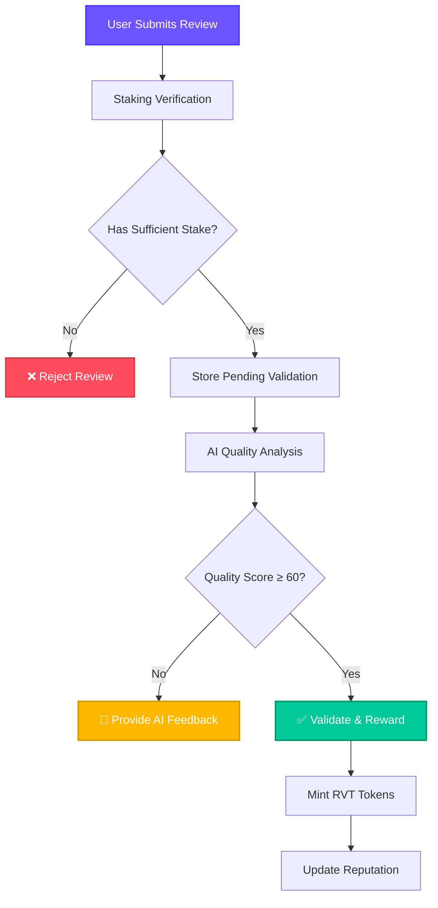

<div align="center">

# 🌟 **Monad AI-Review System** 
### *The World's First AI-Assisted Blockchain Review Platform*

**[ 🧠 AI-Powered Validation ] [ ⚡ Real-Time Rewards ] [ 🔐 Staking Security ] [ 🏗️ Monad Native ]**

</div>

---

## 🎯 **The Vision**
Transform reviews from rejection to improvement with **AI-guided enhancement** and **instant blockchain rewards**.

<p align="center">
  
  
  
</p>

---

## 🚀 **Core Features**

| **AI Enhancement** | **Staking Security** | **Real-Time Rewards** | **Monad Power** |
|:---:|:---:|:---:|:---:|
| 🤖 Instead of rejecting poor reviews, **AI provides improvement feedback** | 🛡️ Users **stake tokens** to submit reviews, ensuring commitment | ⚡ **Instant token rewards** for validated reviews | 🚀 Built on **Monad's execution events** |
| 📝 "Your review is too short → Add specific examples" | 💎 **Economic commitment** prevents spam | 🏆 Quality-based rewards (0-100 scoring) | 🔥 **Sub-second** transaction speeds |

---

## 🏗️ **Smart Contract Architecture**



---

## 📊 **Live Contract Addresses**

| Contract | Address | Purpose |
|----------|---------|---------|
| **ReviewToken** | `0x9Ce5...de83` | 🪙 Reward token (RVT) |
| **ReputationSystem** | `0xF158...4DBC` | 📈 Quality tracking |
| **ReviewStaking** | `0x51F7...9c1D` | 🛡️ Staking verification |
| **ReviewPlatform** | `0x40C1...D10d` | ⚙️ Main orchestration |

---

## 🔥 **Monad Superpowers**

> [!TIP]
> **MonadDb** - Ultra-fast storage with io_uring (parallel I/O)
> 
> **Execution Events** - Real-time data processing without polling
> 
> **Staking Precompile** - Direct smart contract integration with `0x000...1000`
> 
> **High Throughput** - Thousands of reviews per second

---

## 🎮 **Quick Start**

```bash
# Clone the project
git clone https://github.com/monad-review/ai-system.git

# Install dependencies
cd frontend && npm install

# Connect to Monad testnet
# Submit reviews and earn RVT tokens instantly!
```

---

## 🌐 **How It Works**

1. **👤 User** submits a review
2. **🛡️ Staking** verifies commitment (`canUserReview()`)
3. **🤖 AI** analyzes quality and provides feedback
4. **⚡ Monad** validates and mints rewards instantly
5. **📊 Reputation** updates based on quality
6. **🪙 Tokens** distributed in subseconds

---

<div align="center">

### 🌟 **Revolutionizing Reviews, One Enhancement at a Time**

**Built for Monad** ✨ **Powered by AI** ✨ **Rewarding Quality**

</div>